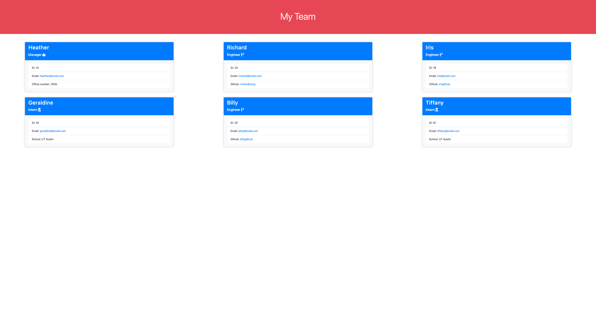

# Team Badge Generator

[](https://opensource.org/licenses/MIT)


## Description
This app takes user input via the CLI and creates an index.html file with a badge for each team member based on the information given.


## Technologies
This app is built with [Node.js](https://nodejs.org/en/), Node.js' native [filesystem](https://nodejs.org/api/fs.html) module, [Inquirer](https://www.npmjs.com/package/inquirer) npm module (version 8.2.4), and lastly [Jest](https://jestjs.io/) for unit testing.


## Table of Contents
  - [Installation](#installation)
  - [Usage](#usage)
  - [Architecture](#architecture)
  - [Screenshot](#screenshot)
  - [License](#license)
  - [Improvements](#improvements)
  - [Questions](#questions)


## Installation

After cloning the repository, user should run the following command within the terminal:
```
npm install
```
Afterwards check towards the bottom within package.json; the user should see inquirer version 8.2.4 as a dependency and jest version 24.9.0 as a dependency.

```
...
  "dependencies": {
    "inquirer": "^8.2.4",
    "jest": "^24.9.0"
  }
```

## Usage
After installing inquirer and jest, the user should run the following commands within the terminal:
```
cd assets/js
node index.js
```
The CLI will ask a series of questions to grab which team member badges to dynamically load into the index.html file within ./dist once the user ends the dialog via selecting 'Finish building team'.

For unit testing, the user should run the following command within terminal:
```
npm run test
```

There are a total of 6 tests suites to run: 
  * 1 for Employee Class 
  * 3 for Manager, Engineer, and Intern Classes
  * 1 for generateClasses functionality
  * 1 for validateAnswers functionality

## Architecture
The code is split into four files: the main index.js at root level, generateHTML.js file within utils, generateClasses within utils, and validateAnswers within utils. 
  * index.js acts as the portion of the app that grabs user input via Inquirer and the CLI. Within the switch statement of promptUser at the end, there are two cases in which promptUser recursively runs to continue the dialog for each additional team member that is added. Once the user selects the 'Finish build team' case, then writeToFile is invoked which informs the app the file path to save to as well as invokes the invokes the imported generateHTML function.
  * generateHTML takes the team data passed from index.js and generates boilerplate HTML code. It also invokes createCard to create a badge for each team member along with renderEmployeeBadgeIcon and renderContextualProperty for slight differences between badges based on the employeeType.
  * generateClasses takes the inquirer answers that are pushed into the team array and converts each item (essentially each employee's profile) into an instance of the appropriate Class for the employee.
  * validateAnswers provides the logic for validating the answer to each of the Inquirer prompt questions.

For the unit testing, each of the Classes are stored within lib and the respective tests can be found within __tests__. generateClasses and validateAnswers within utils folder also have respective tests within __tests__.


## Screenshot


## Video Demo
[Video demo link](https://drive.google.com/file/d/1B1N-L0JB6uhiJtRCiLQvVhd5MKfAmyiB/view)


## License
This app was licensed under the MIT License.


## Improvements
One fairly obvious improvement would be to apply more CSS on each of the badges and page overall. There is also a lack of accounting for different viewport/screensizes in the app's current state.

Lastly while I was able to get the HTML to be generated within generateHTML, I had trouble trying to use a script injection within the boilerplate and then have the script file instead apply the addition of badges. I'd look into if it's more efficient to extract the logic for creation of badges from the same file creating the boilerplate HTML.


## Questions
Questions, comments, concerns? Send me an email at rhong24@gmail.com.
